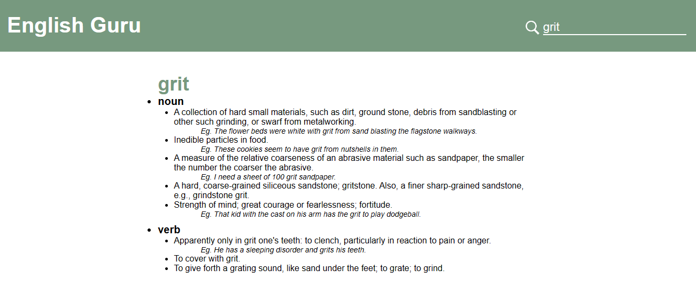

# EnglishGuru
Available at: https://demarb.github.io/EmojiFindr/

## Project Overview:
English Guru is an online english Dictionary that allows the user to search for a word and return its definition(s). 

## Key Features:
EnglishGuru can:
Search for a word provided by the user
Display the word, its part of speech and meanings to the screen
Display a message if the word is not found

### API Used:
[freeDictionaryAPI](https://github.com/meetDeveloper/freeDictionaryAPI)

### Preview:

